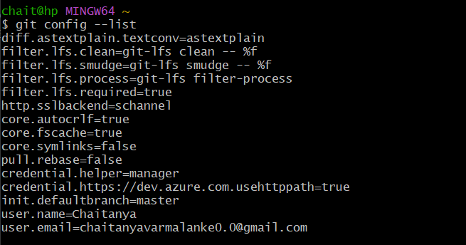
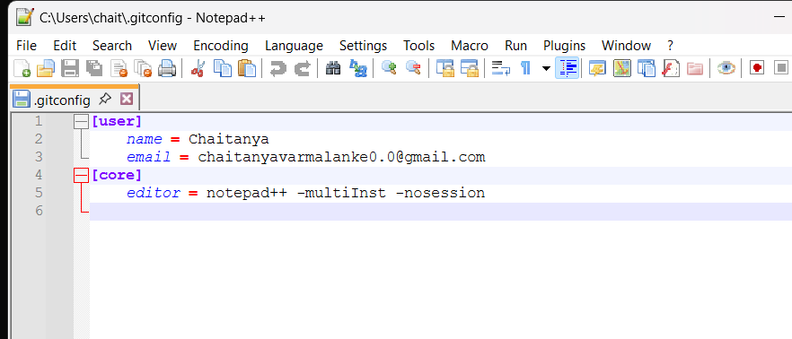
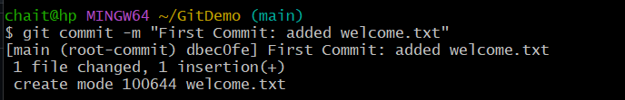
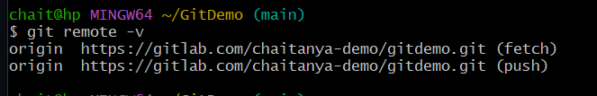
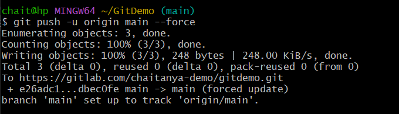
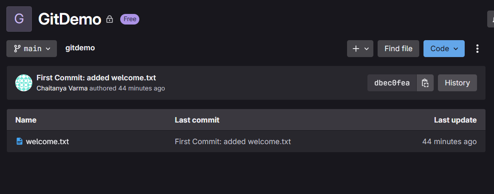

# Git Hands-on Lab – GitDemo

## Objective
This lab demonstrates the use of basic Git commands and integration with GitLab, along with setting up Notepad++ as the default Git editor.

---

## Step 1: Setup Git Configuration

**Check Git Installation**
```bash
git --version
````

**Configure Username and Email**

```bash
git config --global user.name "Chaitanya"
git config --global user.email "chaitanyavarmalanke0.0@gmail.com"
```

**Verify Configuration**

```bash
git config --list
```



---

## Step 2: Integrate Notepad++ with Git

**Verify Notepad++ Opens from Git Bash**

```bash
notepad++
```

**Set Notepad++ as Default Git Editor**

```bash
git config --global core.editor "notepad++ -multiInst -nosession"
```

**Verify Notepad++ as Editor**

```bash
git config --global -e
```



**Test Commit Using Notepad++**

1. Make a change to a file.
2. Stage the change:

   ```bash
   git add filename
   ```
3. Commit (Notepad++ will open for message entry):

   ```bash
   git commit
   ```


---

## Step 3: Create and Add a File to Git Repository

**Initialize Repository**

```bash
mkdir GitDemo
cd GitDemo
git init -b main
```

**Create File**

```bash
echo "Hello GitLab!" > welcome.txt
```

**Check Status**

```bash
git status
```

**Stage File**

```bash
git add welcome.txt
```

**Commit File**

```bash
git commit -m "First commit: added welcome.txt"
```



---

## Step 4: Connect to GitLab and Push

**Add Remote Repository**

```bash
git remote add origin https://gitlab.com/chaitanya-demo/gitdemo.git
```

**Verify Remote**

```bash
git remote -v
```



**Push to Main**

```bash
git push -u origin main
```



---

## Step 5: Outcome

* Local repository successfully linked with GitLab.
* `welcome.txt` is visible in the `main` branch on GitLab.
* Notepad++ is integrated as Git’s default editor.



---

