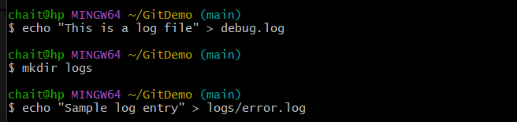
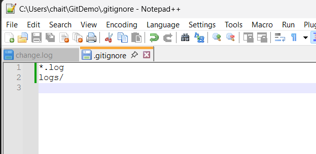
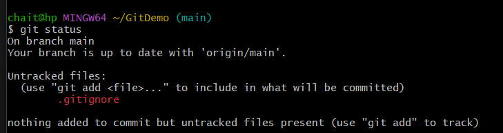
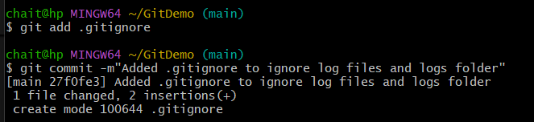
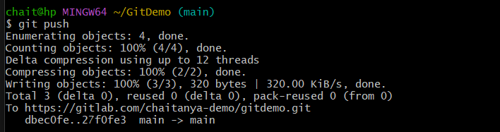
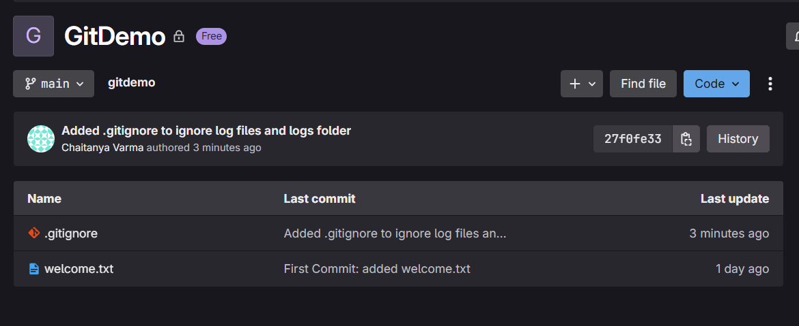

# Git Hands-on Lab 2 – Using .gitignore

## Theory

### What is `.gitignore`?
The `.gitignore` file tells Git which files or directories to skip when tracking changes. This helps keep unnecessary, temporary, or sensitive files out of version control.

### Why use `.gitignore`?
- Prevents large or auto-generated files from bloating the repository.
- Keeps sensitive information (like credentials) out of source control.
- Ensures only the important files are tracked.

### How `.gitignore` Works
- You create a `.gitignore` file in your repository.
- Inside it, you add patterns to match files or folders you want to ignore.
- Examples:
  - `*.log` → Ignore all `.log` files in the repo.
  - `logs/` → Ignore the entire `logs` folder.
  - `/temp.txt` → Ignore only `temp.txt` in the root directory.

---

## Objective
This lab demonstrates how to use `.gitignore` in Git to exclude unwanted files and folders from being tracked.

---

## Step 1: Prerequisites
- Git environment already set up.
- Notepad++ integrated as Git default editor.
- A local Git repository linked to a remote GitLab repository.

---

## Step 2: Create Files and Folders to Ignore

```bash
echo "This is a log file" > debug.log
mkdir logs
echo "Sample log entry" > logs/error.log
````



---

## Step 3: Create `.gitignore` File

```bash
notepad++ .gitignore
```

Add the following lines to `.gitignore`:

```
*.log
logs/
```

This means:

* Ignore all files ending in `.log`.
* Ignore the entire `logs` folder and its contents.



---

## Step 4: Verify `.gitignore` Works

```bash
git status
```

Expected output:

* `.gitignore` appears as untracked.
* `debug.log` and `logs/` folder are not listed.



---

## Step 5: Commit and Push `.gitignore`

```bash
git add .gitignore
git commit -m "Added .gitignore to ignore log files and logs folder"
git push
```



---

## Step 6: Outcome

* `.gitignore` is present in the repository.
* `debug.log` and `logs/` folder are excluded from Git tracking.
* Changes successfully pushed to GitLab.



---

