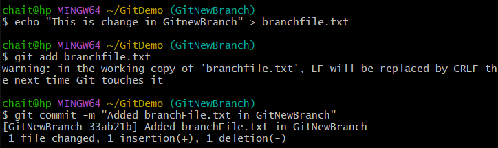
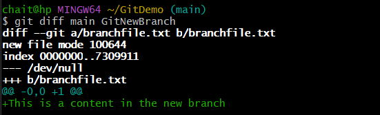
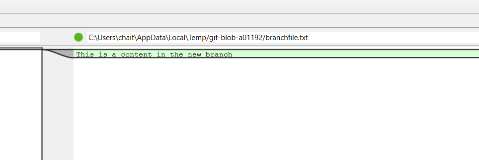
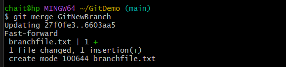
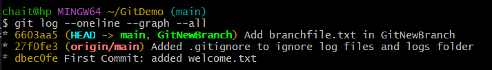

# Git Hands-on Lab 3 – Working with Branches and P4Merge

## Objective
This lab demonstrates how to create and manage branches in Git, compare them using **two different methods** (command-line and P4Merge), and merge changes back into the main branch.

---

## Step 1: Prerequisites
- Git environment already set up.
- Local repository linked to remote GitLab repository.
- **P4Merge** installed and configured as Git's default `difftool`.

---

## Step 2: Create and View Branches
```bash
git branch GitNewBranch
git branch -a
````

This creates a new branch and lists all local and remote branches.


---

## Step 3: Switch to the New Branch

```bash
git checkout GitNewBranch
```


---

## Step 4: Make Changes in the New Branch

```bash
echo "This is a change in GitNewBranch" > branchfile.txt
git add branchfile.txt
git commit -m "Added branchfile.txt in GitNewBranch"
```



---

## Step 5: Compare Branches (Method 1 – Command Line)

```bash
git diff main GitNewBranch
```

This shows the difference between the two branches in text format.



---

## Step 6: Compare Branches (Method 2 – P4Merge)

```bash
git difftool main GitNewBranch
```

This opens the differences in **P4Merge** with a visual side-by-side comparison.




---

## Step 7: Merge the Branch into Main

```bash
git checkout main
git merge GitNewBranch
```





---

## Step 8: View Commit History

```bash
git log --oneline --graph --all
```



---

## Step 9: Delete the Merged Branch

```bash
git branch -d GitNewBranch
```


---

## Outcome

* Created a new branch and viewed all branches.
* Made and committed changes in the new branch.
* Compared differences using both **command-line** and **P4Merge**.
* Merged changes into the main branch and deleted the extra branch.

---
