# Git Hands-on Lab 4 – Resolving Merge Conflicts

## Objective

This lab demonstrates how to handle merge conflicts in Git when changes in the main branch and a feature branch overlap. It shows how to resolve such conflicts using a 3-way merge tool (**P4Merge**).

---

## Step 1: Prerequisites

Before starting, ensure:

* Git is installed and configured.
* Your local repository is connected to a remote GitLab repo.
* **P4Merge** is installed and set as Git’s default merge tool.

---

## Step 2: Verify Master is in a Clean State

Start on the main branch and verify there are no uncommitted changes.

```bash
git checkout main
git status
```

This confirms a clean working directory, ensuring no conflicts arise from local changes.

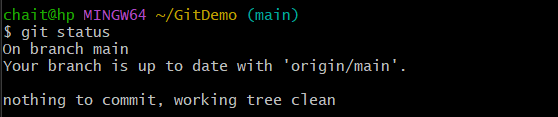

---

## Step 3: Create a Branch and Add a File

Create a new branch `GitWork` and add a file `hello.xml` with an initial message. Commit this new file.

```bash
git branch GitWork
git checkout GitWork
echo "<message>Hello from GitWork branch</message>" > hello.xml
git add hello.xml
git commit -m "Added hello.xml in GitWork branch"
```

You should see your new commit reflected here.

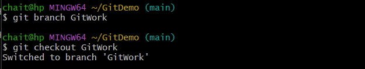
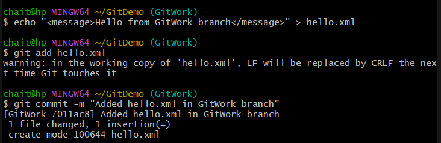

---

## Step 4: Modify File in Branch

Make changes to `hello.xml` in the `GitWork` branch and commit the update.

```bash
echo "<message>Updated content in GitWork branch</message>" > hello.xml
git status
git add hello.xml
git commit -m "Updated hello.xml in GitWork branch"
```

This simulates development progress on your feature branch.

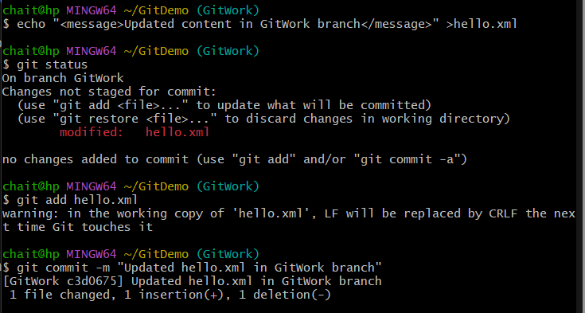

---

## Step 5: Switch to Main and Add a Conflicting File

Switch back to `main` branch and add a conflicting `hello.xml` file with different content. Commit this conflicting change.

```bash
git checkout main
echo "<message>Conflicting content from main branch</message>" > hello.xml
git add hello.xml
git commit -m "Added conflicting hello.xml in main"
```

This sets up the merge conflict scenario.

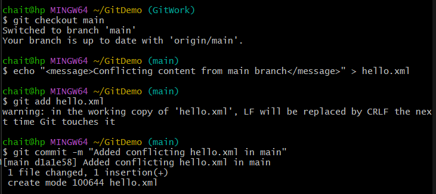

---

## Step 6: View Commit History

Use a graphical log to visualize the commits and branches, showing diverging histories that will cause the conflict.

```bash
git log --oneline --graph --decorate --all
```

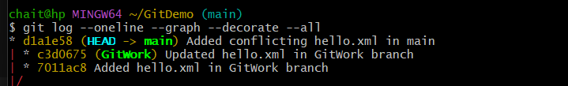

---

## Step 7: Check Differences (Command Line)

See the line-by-line differences between the two branches for `hello.xml`.

```bash
git diff main GitWork
```

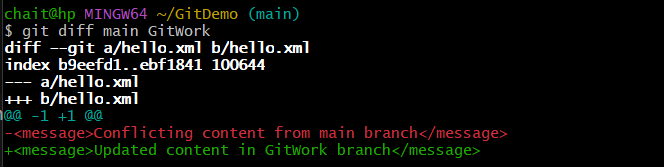

---

## Step 8: Check Differences (P4Merge)

Use **P4Merge** as a visual diff tool to better understand the conflicting changes side-by-side.

```bash
git difftool main GitWork
```

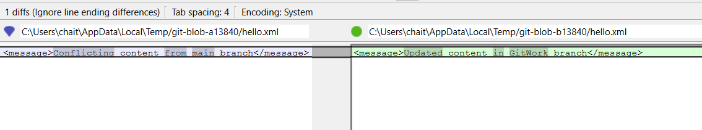

---

## Step 9: Merge and Observe Conflict

Attempt to merge `GitWork` into `main`. Git will detect conflicting changes in `hello.xml` and pause for manual resolution.

```bash
git merge GitWork
```

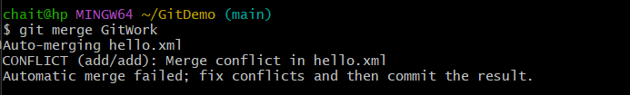

---

## Step 10: Resolve Conflict Using P4Merge (3-Way Merge)

Launch the merge tool to resolve conflicts by choosing changes from either branch or combining both.

```bash
git mergetool
```

* Carefully select the correct parts from each version in **P4Merge**.
* Save and exit the tool to finalize the resolution.

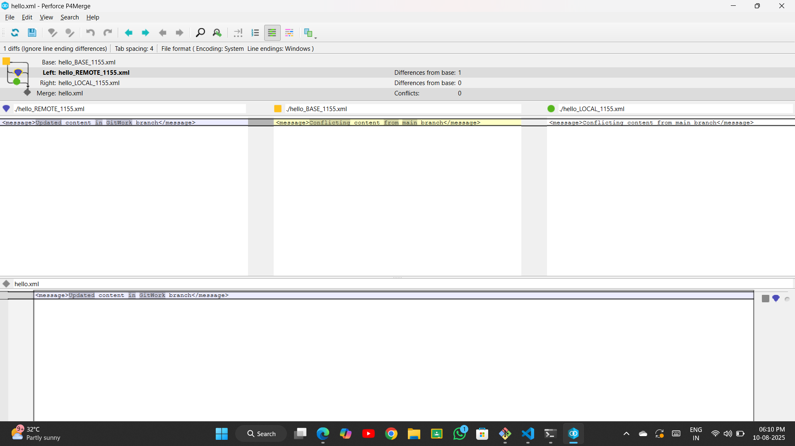

---

## Step 11: Commit the Merge Resolution

After resolving, stage the fixed file and commit the merge.

```bash
git add hello.xml
git commit -m "Resolved merge conflict in hello.xml"
```

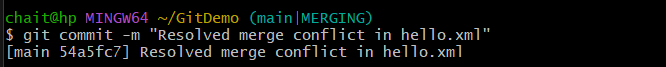

---

## Step 12: Ignore Backup Files

Add backup files (e.g., `*.*~`) to `.gitignore` to prevent accidental commits of temporary files created by editors or merge tools.

```bash
echo "*.*~" >> .gitignore
git add .gitignore
git commit -m "Added backup files to .gitignore"
```

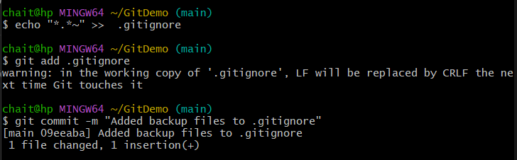

---

## Step 13: Delete the Branch

Once merged, clean up by deleting the feature branch locally.

```bash
git branch -d GitWork
```

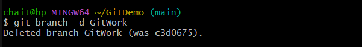

---

## Step 14: View Final Commit History

Confirm the merge is complete and view the final commit graph with the merged histories.

```bash
git log --oneline --graph --decorate
```

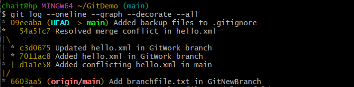

---

## Outcome

* Simulated a merge conflict scenario between `main` and a feature branch.
* Used **P4Merge** to resolve the conflict via a 3-way merge.
* Ignored backup files in `.gitignore` to keep repo clean.
* Completed merge and cleaned up branches for a tidy history.

---

