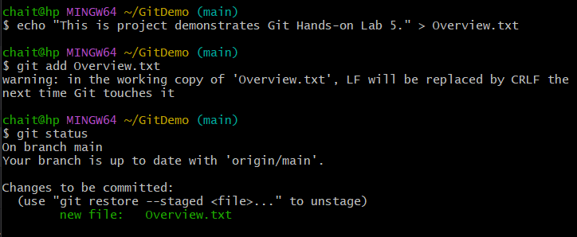
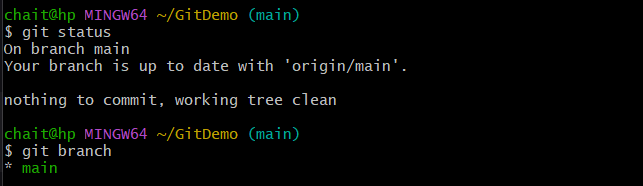
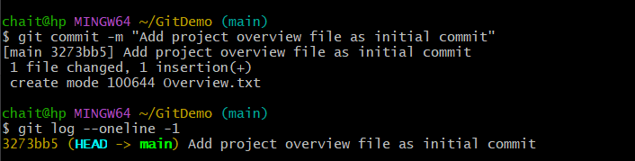
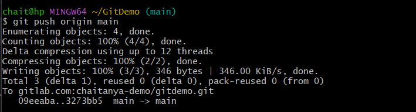
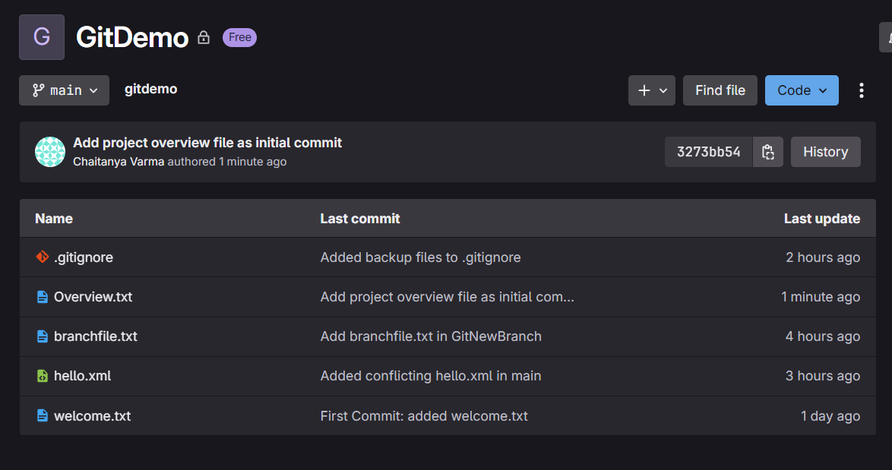

# Git Hands-On Lab 5 – Initial Commit and Push to Remote Repository

## Objective

This lab focuses on pushing the very first commit from a local Git repository to an empty remote repository. The goal is to initialize the remote repository with a branch and upload project files, enabling further collaboration and version control.

---

## Step 1: Verify the Local Repository State

Ensure you are inside your local Git repository and verify the current branch and status:

```bash
git status
git branch
````

Confirm that your working directory is clean or has files ready to be committed.



---

## Step 2: Create a Project Description File

Create a new file named `Overview.txt` with some initial content describing the project:

```bash
echo "This project demonstrates Git Hands-on Lab 5." > Overview.txt
```

This file will serve as the first tracked file in the repository.


---

## Step 3: Stage the File for Commit

Add the new file to the staging area:

```bash
git add Overview.txt
```

Check the status again to confirm the file is staged:

```bash
git status
```



---

## Step 4: Commit the Changes Locally

Make your first commit with a descriptive message:

```bash
git commit -m "Add project overview file as initial commit"
```

Verify the commit was successful:

```bash
git log --oneline -1
```



---

## Step 5: Push the Commit to Remote Repository

Push your local branch (e.g., `main`) to the remote repository:

```bash
git push origin main
```

This command creates the `main` branch remotely and uploads your commit.



---

## Step 6: Verify the Remote Repository

Visit your remote repository on GitHub/GitLab in a web browser and confirm that:

* The branch `main` exists.
* The file `Overview.txt` is present.
* Your commit message is shown in the commit history.



---

## Outcome

* Successfully created and committed a new file locally.
* Initialized the remote repository by pushing the first commit.
* Learned why the first push is necessary before performing pulls or further pushes.
* Established a clean base for continued development and collaboration.

---

## Notes

* Until the first commit is pushed, the remote repository has no branches or commits.
* Any file can be used for the initial commit; it need not be a README.
* Clear commit messages improve project history readability.

---